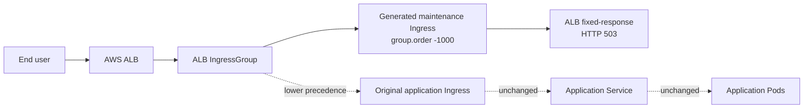
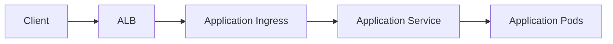
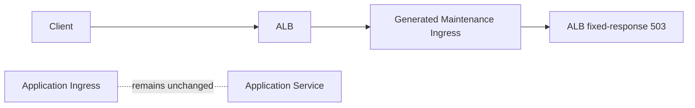

# Architecture

## At a Glance

The operator gives the ALB a higher-priority maintenance rule without rewriting the application team's Ingress. That is the whole value proposition.

## Maintenance Custom Resource

The `Maintenance` custom resource is the operator API for enabling or disabling maintenance mode for one application Ingress. A resource names a target Ingress through `spec.targetIngress` and controls behavior through `spec.enabled`.

The target Ingress must already be managed by AWS Load Balancer Controller and must belong to an ALB IngressGroup.

## Reconciliation Flow

When a `Maintenance` resource is created or updated, the controller:

1. Adds a finalizer to the `Maintenance` resource.
2. Reads the target Ingress from the same namespace.
3. Validates that the target is ALB-managed and has `alb.ingress.kubernetes.io/group.name`.
4. Creates a one-time backup ConfigMap owned by the `Maintenance` resource.
5. Creates or reconciles a separate generated maintenance Ingress.
6. Updates status phase, message, and the standard `Ready` condition.

On disable, the controller deletes the generated maintenance Ingress and backup ConfigMap. It does not patch, replace, or restore the original application Ingress.

On deletion, the controller deletes the generated maintenance Ingress first, waits until it is gone, deletes the backup ConfigMap, and then removes the finalizer.

## Overlay Ingress Model

The operator uses an overlay model. The application Ingress remains the business-owned routing object. The maintenance Ingress is a temporary operator-owned object that joins the same ALB group and takes precedence.

This model avoids a risky anti-pattern: mutating production application routing state and later attempting to restore it from a backup. In cloud operations, that kind of restore logic is a sharp edge. The operator keeps the application Ingress read-only during normal enable and disable.

## ALB IngressGroup Behavior

AWS Load Balancer Controller merges Ingresses with the same `alb.ingress.kubernetes.io/group.name` into one ALB rule set. Lower `alb.ingress.kubernetes.io/group.order` values take precedence.

The generated maintenance Ingress:

- copies the target Ingress group name;
- sets `alb.ingress.kubernetes.io/group.order: "-1000"`;
- removes inherited ALB action annotations;
- removes target-group-specific health check/backend annotations;
- adds only `alb.ingress.kubernetes.io/actions.maintenance`.

## Normal Traffic Flow

## Maintenance Traffic Flow

## Watches

The controller watches:

- `Maintenance` resources;
- owned backup ConfigMaps;
- owned generated maintenance Ingresses;
- target Ingress changes filtered by the `spec.targetIngress` field index.

Owned Ingress watches repair drift or manual deletion of the generated maintenance Ingress. Target Ingress watches allow maintenance overlays to be reconciled when the source application Ingress changes.
