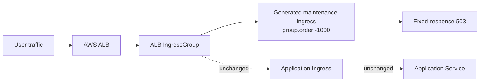

# Why AWS Load Balancer Controller Fights You When You Need a Maintenance Page

AWS Load Balancer Controller is excellent at turning Kubernetes Ingress resources into ALB rules. The pain starts when an application team needs a maintenance page without permanently editing production routing.

The obvious approaches all have teeth:

- patch the application Ingress and hope the rollback is clean;
- create ad hoc ALB fixed-response annotations by hand;
- rely on a runbook during an outage window;
- ask the platform team to touch every app namespace manually.

That is too much ceremony for a high-pressure workflow.

`app-maintenance-operator` takes a different path. It leaves the application Ingress alone and creates a temporary overlay Ingress in the same ALB IngressGroup. The overlay has a lower `alb.ingress.kubernetes.io/group.order`, so AWS Load Balancer Controller gives it precedence and returns a fixed 503 maintenance response.

The important design choice is restraint: the operator does not mutate the original application Ingress during normal enable or disable. That reduces rollback risk and makes the operational story easier to trust.

This is not a silver bullet. The first release is intentionally narrow:

- AWS ALB fixed-response only;
- 1024-byte fixed-response body limit;
- target Ingress and `Maintenance` resource must be in the same namespace.

Those constraints are real, but they are explicit. The operator is built to remove one sharp edge first: safely putting an ALB-backed app into maintenance mode without editing the app team's Ingress.

